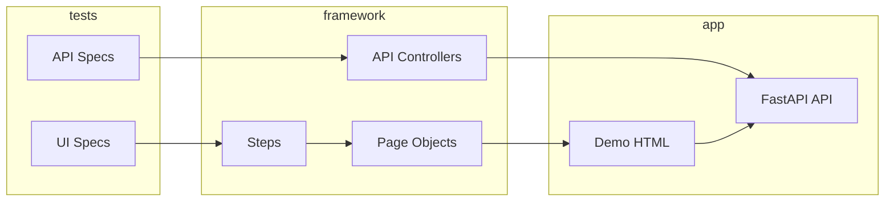

# bookstore-automation-python

Playwright + Python test automation for the **Online Bookstore** mock application.

**Allure Report (CI):** https://ausievich.github.io/bookstore-automation-python/

## Stack

- Playwright, pytest, pytest-playwright
- Page Object Model + Steps layer
- Allure reporting (`allure-pytest`)
- httpx API clients (Controller / Builder / Flow)
- Ruff + mypy
- Mock app: static HTML UI + FastAPI REST API
- [uv](https://docs.astral.sh/uv/) + [taskipy](https://github.com/illBeRoy/taskipy) for project tasks

## Quick start

Requires **Python 3.12+** and [uv](https://docs.astral.sh/uv/getting-started/installation/).

```bash
uv sync
uv run playwright install chromium
```

Start the mock server (required for tests):

```bash
uv run task server
```

In another terminal:

```bash
uv run task test
```

## Allure report (local)

Requires **JDK 17+** (Allure CLI is Java-based). On first run, Allure is downloaded into `.allure-cli/` automatically.

Run tests, generate the report, and open it in the browser:

```bash
uv run task report
```

Or step by step:

```bash
uv run task test
uv run task allure-gen
uv run task allure-open
```

| Output | Description |
|--------|-------------|
| `allure-results/` | Raw results from the last test run (gitignored) |
| `allure-report/` | Generated HTML report (gitignored) |

Tests attach Allure labels via `allure_metadata(layer, suite, owner)` — **Suites** groups by `layer` (UI/API) then suite name, same as the JS project.

## Demo application

| URL | Description |
|-----|-------------|
| http://localhost:3000/login.html | Login (`user@bookstore.test` / `password123`) |
| http://localhost:3000/catalog.html | Book catalog |
| http://localhost:3000/cart.html | Shopping cart |
| http://localhost:3000/checkout.html | Multi-step checkout |

API base: `http://localhost:3000/api/*`

Start server only: `uv run task server`

## Project layout

```
src/main/ui/        # Pages, Steps, Locators
src/main/api/       # Clients, Controllers, Builders, Flows, Models
src/main/common/    # Config, constants, Allure helpers
src/test/           # pytest specs + fixtures
demo/               # Static UI
mock_server/        # FastAPI API + in-memory store
scripts/            # Allure CLI bootstrap
```

## Tests

| Layer | Specs |
|-------|--------|
| **UI** | login, search/filter, cart, checkout |
| **API** | books CRUD, cart, orders |

Test state is reset via `POST /api/test/reset` before each test (`api_reset` autouse fixture in `conftest.py`).

Run a single layer:

```bash
uv run task test-ui
uv run task test-api
```

### Playwright Inspector (debug)

Set `PWDEBUG=1` to open the [Playwright Inspector](https://playwright.dev/python/docs/debug) — step through actions, inspect locators, and record new steps. Requires the mock server running (`uv run task server`).

Run a single UI test:

```bash
# Linux / macOS / Git Bash
PWDEBUG=1 uv run pytest src/test/ui/test_login.py::TestLogin::test_valid_login_shows_catalog --headed

# PowerShell (Windows)
$env:PWDEBUG=1; uv run pytest src/test/ui/test_login.py::TestLogin::test_valid_login_shows_catalog --headed
```

Test path format: `path/to/test.py::TestClass::test_method`. List tests in a file:

```bash
uv run pytest src/test/ui/test_login.py --collect-only -q
```

Optional: add `page.pause()` in a test to stop at a specific line, then run with `PWDEBUG=1` as above.

Useful flags: `--slowmo=500` (slow down actions), `-s` (show stdout).


| Task | Description |
|------|-------------|
| `uv run task server` | Start mock server on port 3000 |
| `uv run task test` | Run all tests |
| `uv run task test-ui` | UI tests only |
| `uv run task test-api` | API tests only |
| `uv run task lint` | Ruff check + format check |
| `uv run task typecheck` | mypy |
| `uv run task allure-gen` | Generate Allure HTML report |
| `uv run task allure-open` | Open report in browser |
| `uv run task report` | test → allure-gen → allure-open |

## Configuration

Copy `.env` (or create from defaults):

```
BASE_URL=http://localhost:3000
API_URL=http://localhost:3000
```

## Architecture



## CI

On every push and PR to `main`:

**Quality Gates** (ruff, mypy) → **pytest** (mock server + Playwright) → **Allure Report** deployed to GitHub Pages (push to `main` only).

Workflow: [`.github/workflows/ci.yml`](.github/workflows/ci.yml)
